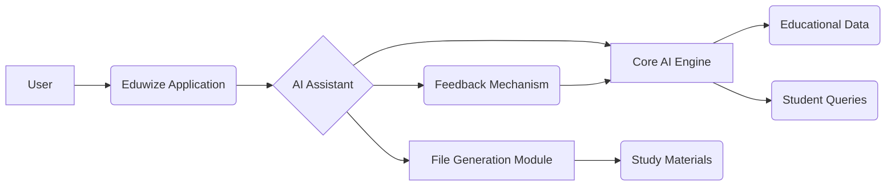

# AI Assistant Implementation Plan

## 1. Architecture Design:

*   **Core AI Engine:**
    *   Utilize a transformer-based language model (e.g., BERT, GPT) fine-tuned on a large dataset of educational materials, NCV curriculum, and student queries.
    *   Implement advanced problem-solving and reasoning capabilities by incorporating techniques like chain-of-thought prompting and knowledge graph integration.
*   **File Generation Module:**
    *   Develop a module specifically for generating summaries of study materials.
    *   This module will use the core AI engine to extract key information from the study materials and create concise and informative summaries.
    *   Support various file formats (e.g., PDF, DOCX, TXT).
*   **Integration with Eduwize Application:**
    *   Replace the existing AI chatbot with the new AI assistant.
    *   Integrate the AI assistant into the existing user interface.
    *   Ensure seamless data flow between the AI assistant and other Eduwize features (e.g., course management, student profiles).
*   **Learning and Adaptation:**
    *   Implement a feedback mechanism to collect student feedback on the AI assistant's performance.
    *   Use this feedback to continuously improve the AI assistant's accuracy and relevance.
    *   Incorporate techniques like reinforcement learning to allow the AI assistant to learn from its interactions with students.

## 2. Technology Stack:

*   **Programming Languages:** Python
*   **AI Frameworks:** TensorFlow, PyTorch
*   **NLP Libraries:** NLTK, SpaCy, Transformers
*   **Database:** PostgreSQL
*   **Cloud Platform:** AWS, Google Cloud, Azure

## 3. Implementation Steps:

1.  **Data Collection and Preprocessing:**
    *   Gather a large dataset of educational materials, NCV curriculum, and student queries.
    *   Clean and preprocess the data to ensure its quality and consistency.
2.  **Model Training and Fine-tuning:**
    *   Train a transformer-based language model on the preprocessed data.
    *   Fine-tune the model on specific tasks, such as question answering, text summarization, and problem-solving.
3.  **File Generation Module Development:**
    *   Develop a module for generating summaries of study materials.
    *   Implement the logic for extracting key information from the study materials and creating concise and informative summaries.
4.  **Integration with Eduwize Application:**
    *   Replace the existing AI chatbot with the new AI assistant.
    *   Integrate the AI assistant into the existing user interface.
    *   Ensure seamless data flow between the AI assistant and other Eduwize features.
5.  **Testing and Evaluation:**
    *   Test the AI assistant's performance on a variety of tasks.
    *   Evaluate the AI assistant's accuracy, relevance, and user satisfaction.
6.  **Deployment and Monitoring:**
    *   Deploy the AI assistant to the Eduwize application.
    *   Monitor the AI assistant's performance and make necessary adjustments.

## 4. Mermaid Diagram:

## 5. Key Considerations:

*   **Data Privacy and Security:** Ensure that student data is protected and used responsibly.
*   **Scalability and Performance:** Design the AI assistant to handle a large number of users and queries.
*   **Maintainability and Extensibility:** Develop the AI assistant in a modular and well-documented manner to facilitate future updates and enhancements.